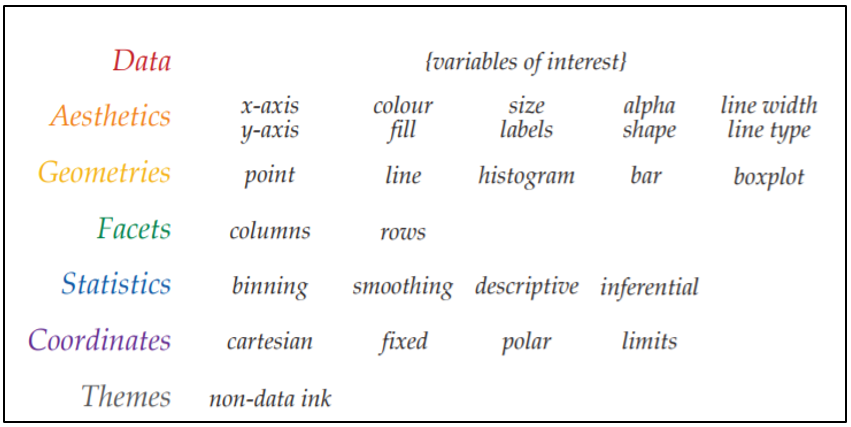

```{r setup, include=FALSE}
knitr::opts_chunk$set(echo = TRUE,
                      message = FALSE,
                      warning = FALSE)
library(Lahman)
library(tidyverse)
library(knitr)
```

## Review

Key concepts

-   five tidyverse verbs

-   relational data bases

-   split, apply, combine

Review Question

-   Using the Batting data frame, determine who held the *career* home
    run record by season from 1900 to the present. In other words,
    produce a table with one row per season indicating who the current
    career home run leader was in baseball at that time. Add their full
    name to the table using the People data frame.

Here is one approach:

-   Add a column to the Batting data frame indicating each player's
    cumulative home runs (hint: cumsum) at the end of the season.

-   write a function that takes a data frame and a year as arguments and
    returns the player with the most career homeruns that year or
    earlier.

-   map the function over the seasons from 1900 to 2019.

-   add player information from the People data frame

```{r}
# add career homeruns to Batting
homeruns = Batting %>% 
  select(yearID, playerID, HR) %>% 
  group_by(playerID) %>% 
  mutate(HRcareer = cumsum(HR)) 

#function to calculate career leader as of year = year
careerLeader = function(data, year){
  data %>% 
    filter(yearID <= year) %>% 
    arrange(-HRcareer) %>%
    select(playerID, HRcareer, yearID) %>% 
    head(1) 
}

# map function over each year

leaders = 1900:2019 %>% map_dfr(data = homeruns, careerLeader)

# another way to apply the function
# leaders = 1900:2019 %>% 
#    map_df(function(x) careerLeader(data = homeruns, year = x))

# add year information
leaders = leaders %>% ungroup() %>% mutate(year = seq(from = 1900, to = 2019, by = 1))

# another way to add the years
# leaders = data.frame(year = 1900:2019, leaders)

#add player's full name
leaders = leaders %>% 
  left_join(select(People, playerID, nameFirst, nameLast))

leaders %>% 
  kable(caption = "Career home run leader by season. yearID indicates the season the record was set")
```

## GGplot: its like baking a cake, you create it in layers

 

### long vs wide format

With ggplot, you will typically want data in long format as opposed to
wide format. What's the difference?

```{r}
# here are Mark McGwire and Sammy Sosa's HR for 1998-2001
data_long <- Batting %>% 
  filter(yearID >= 1998, 
         yearID <= 2001, 
         playerID %in% c("mcgwima01","sosasa01")) %>% 
  select(yearID, playerID, HR)

#this data is in long format
data_long %>% kable()

data_wide <- data_long %>% 
  pivot_wider(id_cols = playerID, names_from = yearID, values_from = HR)

#this data is in wide format
data_wide %>% kable()

#to go back to long format
data_wide %>% pivot_longer(cols = -1, names_to = "Year", values_to = "HR")
```

A basic ggplot has the data frame, aesthetic, and at least one geometry
Going back to the Review, let's plot the number of home runs for the
career home run leader by year.

```{r, fig.height=3}
leaders %>% 
  ggplot(aes(x =year, 
             y = HRcareer)) + 
  geom_line()
```

Now, let's add the player's name to the plot:

```{r, fig.height=3}
leaders %>% 
  ggplot(aes(x = year, 
             y = HRcareer,
             linetype = nameLast)) + 
  geom_line()
```

We can also do this using color rather than linetype (or both):

```{r, fig.height=3}
leaders %>% 
  ggplot(aes(x = year, 
             y = HRcareer,
             linetype = nameLast,
             color = nameLast)) + 
  geom_line()
```

Next, let's change the labels and add a title:

```{r, fig.height=3, caption = "Career home run leader by season."}
leaders %>% 
  ggplot(aes(x = year, 
             y = HRcareer,
             linetype = nameLast,
             color = nameLast)) + 
  geom_line() +
  labs(x = "Year", y = "Home Runs", color = "Player", linetype = "Player",
       title = "Career Home Run Leader 1900 - 2019")
```

Lastly, let's change the theme:

```{r, fig.height=3, caption = "Career home run leader by season."}
leaders %>% 
  ggplot(aes(x = year, 
             y = HRcareer,
             linetype = nameLast,
             color = nameLast)) + 
  geom_line() +
  labs(x = "Year", y = "Home Runs", color = "Player", linetype = "Player",
       title = "Career Home Run Leader 1900 - 2019")+
  theme_classic()
```

### Your turn

Using the Batting data frame, plot a scatterplot of Henry Aaron's home
runs (`y-axis`) vs batting average (`x-axis`) by season. Color the
points in the plot by team name. Change the labels to "Batting Average", "Home
Runs", and "Team".

```{r, fig.height=3, fig.cap = "Henry Aaron's home runs vs batting average by year and team."}
aaron = Batting %>%
filter(playerID == "aaronha01") %>% left_join(select(Teams, teamID,
name)) %>% mutate(AVG = H/AB)

aaron %>% ggplot(aes(x = AVG, y = HR, color = name)) + geom_point() +
  labs(x = "Batting Average", y = "Home Runs", color = "Team",
       title = "Hank Aaron's Home Runs vs Batting Average by Team and Year")+
  theme_classic()
```